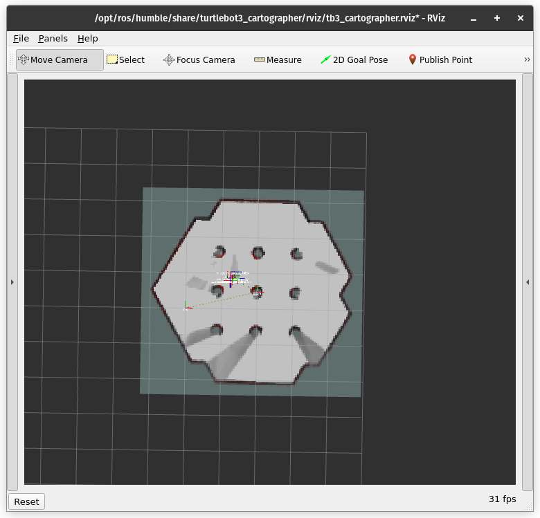
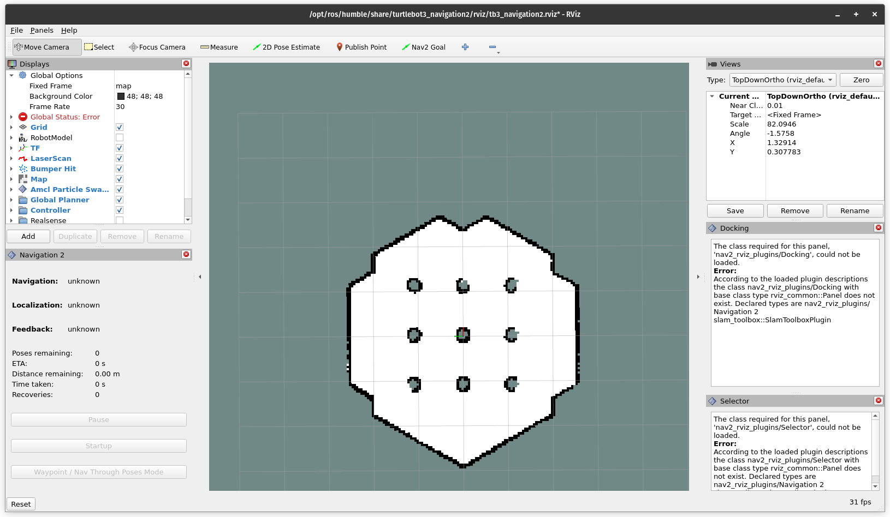
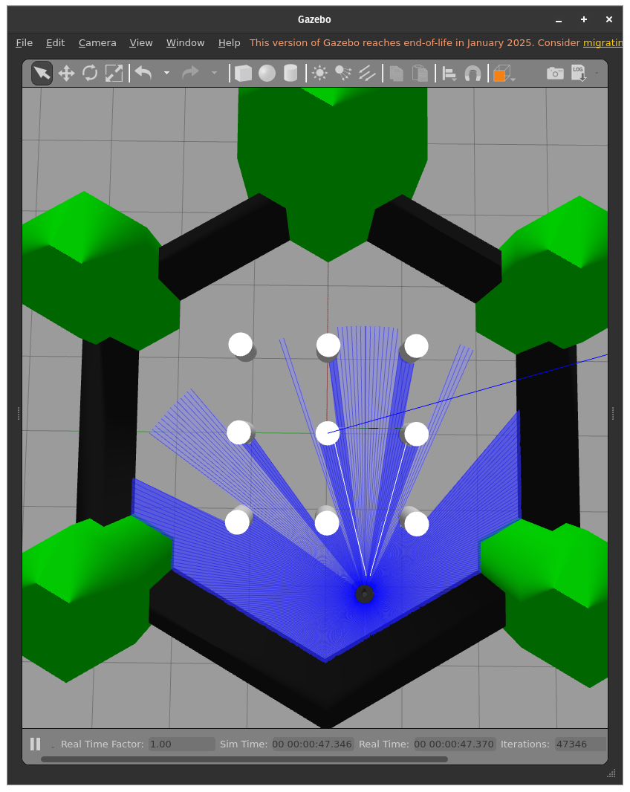
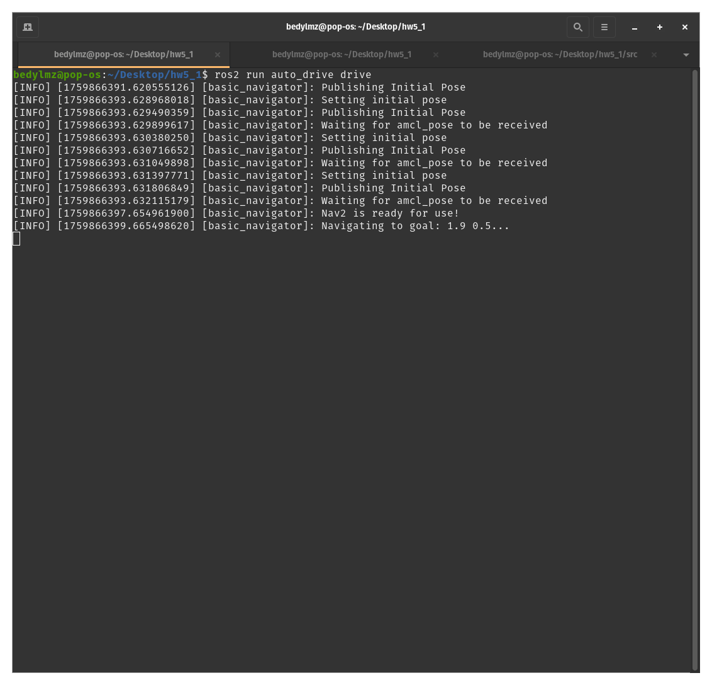
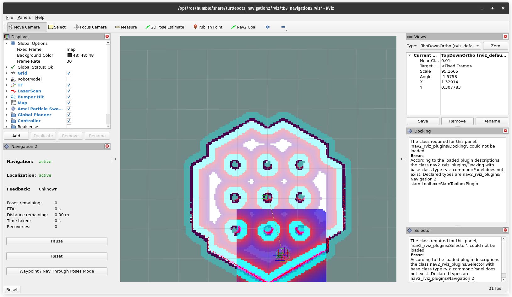
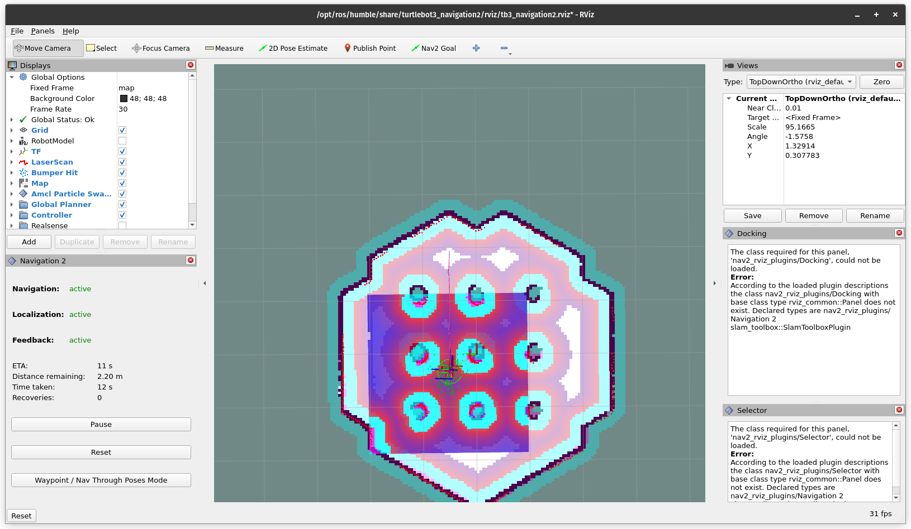
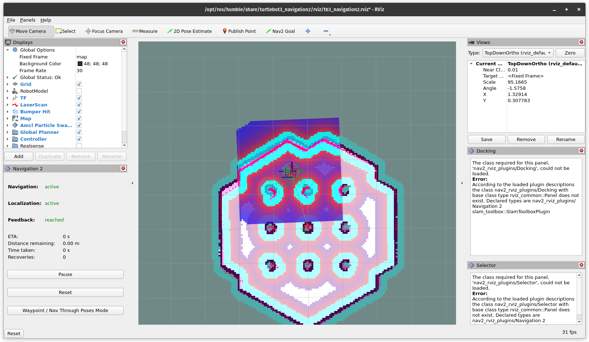
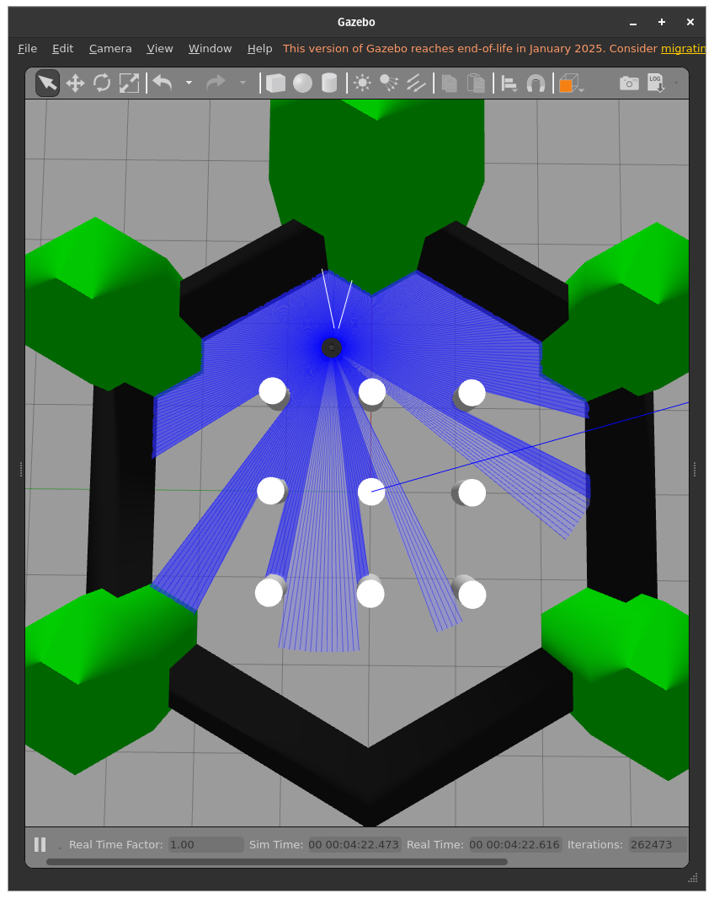

# **ROS2 Navigation 2**

This repository performs autonomous driving using Navigation 2.


### **How to Run**

Run TurtleBot3 Gazebo simulation
```bash
    export TURTLEBOT3_MODEL=waffle
  	export RMW_IMPLEMENTATION=rmw_cyclonedds_cpp
  	source /opt/ros/humble/setup.bash
  	source /usr/share/colcon_argcomplete/hook/colcon-argcomplete.bash

    ros2 launch turtlebot3_gazebo turtlebot3_world.launch.py
```

In another terminal, run Navigation 2 for the Gazebo simulation
```bash
    export TURTLEBOT3_MODEL=waffle
  	export RMW_IMPLEMENTATION=rmw_cyclonedds_cpp
  	source /opt/ros/humble/setup.bash
  	source /usr/share/colcon_argcomplete/hook/colcon-argcomplete.bash

    cd /workSpacePath/src

    ros2 launch turtlebot3_navigation2 navigation2.launch.py use_sim_time:=True maps:=map/map_0.yaml
```

In another terminal, run our package
```bash
    export TURTLEBOT3_MODEL=waffle
  	export RMW_IMPLEMENTATION=rmw_cyclonedds_cpp
  	source /opt/ros/humble/setup.bash
  	source /usr/share/colcon_argcomplete/hook/colcon-argcomplete.bash

    source /workSpacePath/install/setup.bash # or locate workspace and run below code
    # source /install/setup.bash
    ros2 run auto_drive drive
```

### **Important Notes**

* If you cannot run please contact to me.

---

### **ScreenShots**

Screenshot of Rviz while mapping manually with the robot


Our map in Rviz


Initial position of the robot in Gazebo


Running our package in the terminal


Rviz after running our package


Robot moving toward the destination in Rviz


Robot reaching the destination in Rviz


Robot reaching the destination in Gazebo

